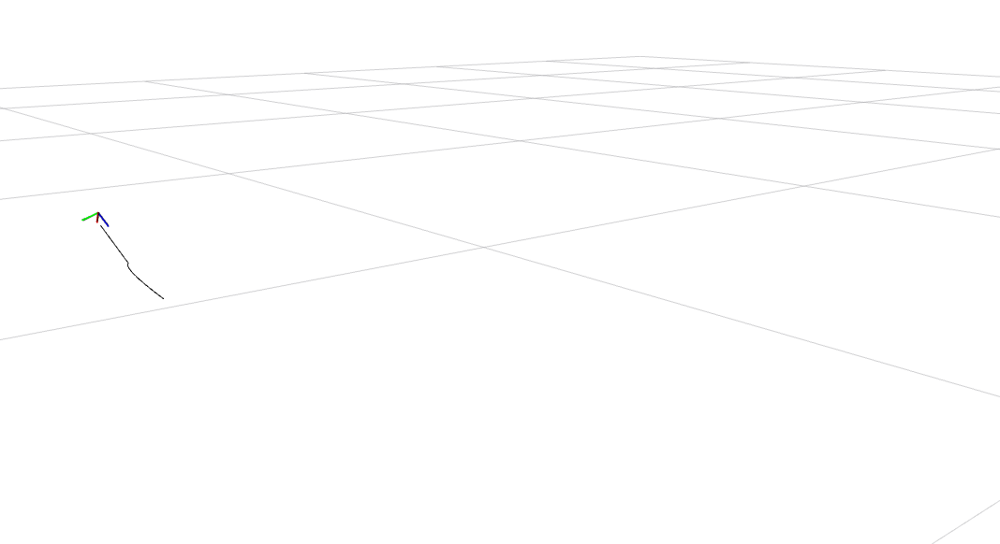

This package shows how [invariants_py](https://github.com/trajectory-invariants/invariants_py) can be integrated in a ROS application.

Currently there are two examples:

1. online calculation of trajectory invariants from trajectory data on a subscribed ROS topic with message type `geometry_msgs/Pose`
1. online trajectory generation from an invariant model towards a changing position provided by a ROS topic with message type `geometry_msgs/Point`

### Installation

Dependencies:

- ROS Noetic on Ubuntu 20.04 is assumed to be installed. Other versions of ROS and Ubuntu should normally work as well but haven't been tested. 
- A catkin workspace is assumed to be created (e.g. at `~/catkin_ws`) and configured for Python 3 using `catkin_make -DPYTHON_EXECUTABLE=/usr/bin/python3`.
- [invariants_py](https://github.com/trajectory-invariants/invariants_py) should be installed in your Python environment.

Open a terminal and clone the [invariants_py_ros](https://gitlab.kuleuven.be/robotgenskill/ros-packages/invariants_py_ros) repository into your Catkin workspace:
```shell
cd ~/catkin_ws/src
git clone https://gitlab.kuleuven.be/robotgenskill/ros-packages/invariants_py_ros
```

Build the package and source the workspace:
```shell
cd ~/catkin_ws/src
catkin_make
source devel/setup.bash
rospack profile
```

### Online invariants calculation

The _ros_invariants_calculation_ node calculates the vector invariants for a point trajectory.

Overview of topics:
- input **/pose_data** : measured pose, message type: _geometry_msgs/Pose_
- output **/pose_data_stamped** : measured pose with timestamp for visualization, message type: _geometry_msgs/PoseStamped_
- output **/trajectory_online** : estimated trajectory by the invariant optimization,  message type: _nav_msgs.msg/Path_

The node can be launched using:

```shell
roslaunch invariants_py_ros launch_invars_calc.launch
```

#### Example 

To test the calculation, you can use

```shell
roslaunch invariants_py_ros launch_invars_calc_test.launch
```

which uses prerecorded data from a bagfile and includes visualization in rviz.

Suggested improvements:

- Only the position data is being used currently. Extend the code so that invariants for rotation are included. To deal with pose messages check the etasl_invariants_integration repository in ERC/python_projects
- The invariants are now time-based using a window of measurements wrt time. How would you obtain time-invariance, a.k.a. geometric invariants that are defined w.r.t. a certain progress variable? 
- Options to visualize results:
-- put results on ROS topics and make an additional ROS node that plots the data in Python
-- put results on ROS topics and use RQTgraph and/or rviz

Quick first test of vizualization in rviz (black = estimated trajectory of the measured object inside window of OCP, axes = current pose measurement but only the position is being used now).



The estimated trajectory is always trailing behind the measurement as expected. There is a small delay between measurement and window, to be checked (note that invariants component is limited to 20 Hz).

### Online trajectory generation

TODO
